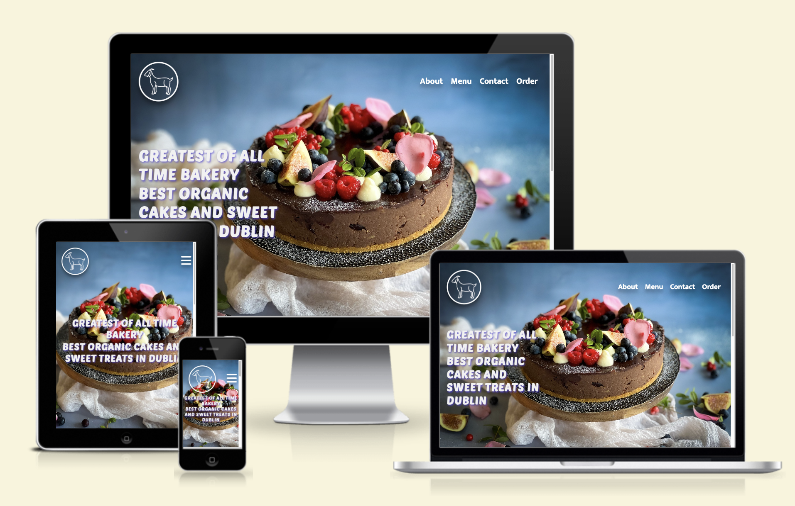
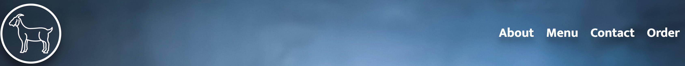
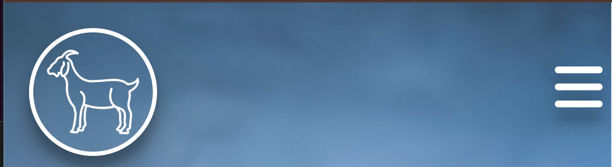
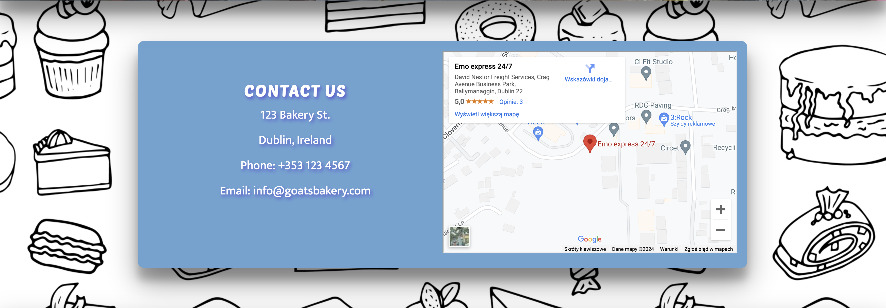

# GOAT Bakery

## Welcome to the GOATs Bakery website

GOATs Bakery site showcases the finest artisan cakes and sweet treats made with high-quality organic ingredients. Our bakery emphasizes eco-friendly practices and delivers delightful, low-sugar desserts. The site is designed for individuals and companies in Dublin seeking premium baked goods.

## Features

GOATs Bakery site has several features that highlight our unique offerings, provide quick contact details, and allow users to obtain quotes for their desired cakes and pastries.
 
#### 1. Navigation Bar    
  * Provides links to all sections on the main page - About Us, Menu, Contact, and Order.
  * Consistent across all pages for easy navigation.
  * Replaced with a hamburger menu on mobile devices for a better user experience.
  
  
 

#### 2. Hero Section
  * Introduces users to GOATs Bakery with an engaging hero image.
  * Text overlay emphasizes our commitment to quality and organic ingredients.
   

#### 3. About Us section 
  * Provides insight into GOATs Bakery's values, mission, and team.
  * Helps users understand our dedication to quality of ingredients and sustainability.
  

#### 4. Contact Us
  * Contains all necessary information to get in touch with GOATs Bakery.
  * Includes a map for easy location of our bakery.
  

#### 5. Footer
  * Displays our selection of cakes and patisseries, including key ingredients.
  * Consistent across the site, with links opening in new tabs.
  

#### 6.  Menu Section
  * Displays our selection of cakes and patisseries, including key ingredients.
  * Divided into two sections: Cakes and Patisseries.
  * Hero image replaced with hero video showcasing best cakes in offer.
  

#### 7. Order Form 
  * Allows customers to send a quote for their desired cakes or patisseries by filling out personal details, delivery destination, and preferred type of cake or patisserie.
  
  

## Testing 
  Extensive testing ensured responsiveness of the GOATs Bakery site across all devices. Several minor bugs were fixed during testing, including:
   * YouTube social icon not being responsive due to missing semicolon. 
   * Overflowing of order form in mobile view due to wrong height units.
  
### Validator Testing 
  1. HTML - minor errors returned and fixed, iframe error ignored due to official copy/past syntax from maps.google.com. All the rest passed though the official [W3C validator](https://validator.w3.org/nu/?doc=https%3A%2F%2Fmr-pete.github.io%2Fgoat-bakery%2Findex.html)
  2. CSS - minor errors returned and fixed. All passed through [Jigsaw validator](https://jigsaw.w3.org/css-validator/validator?uri=https%3A%2F%2Fmr-pete.github.io%2Fgoat-bakery%2Findex.html&profile=css3svg&usermedium=all&warning=1&vextwarning=&lang=pl-PL)

## Deployment
  GOATs Bakery page was deployed to GitHub pages by the standard steps including:
    * Navigation to settings in the GitHub repository and Pages section
    * Selection of Main Branch from drop-down source menu.
 The live link to the website - https://mr-pete.github.io/goat-bakery/index.html
 
 ## Credits
 
 ### Content
  * The text inspirations for the home page were taken from various artisan bakery websites.
  * The instruction on how to build a hamburger menu with html and css was taken from [YouTube Tutorial](https://www.youtube.com/watch?v=qzAAiKFfNLo)
  * The icons for the Contac section and footer were taken from [Font Awesome](https://fontawesome.com/)
 
 ### Media
  * The video and photo used on the website as well as photos used in the gallery were sourced from [Pexels](https://www.pexels.com)
  * Images were optmized and compressed with use of thie free [online tool](https://www.iloveimg.com/)
  * To cut video lenght and covert .mov to .mp4  [Free Convert tool](https://www.freeconvert.com/mov-to-mp4) was used

    